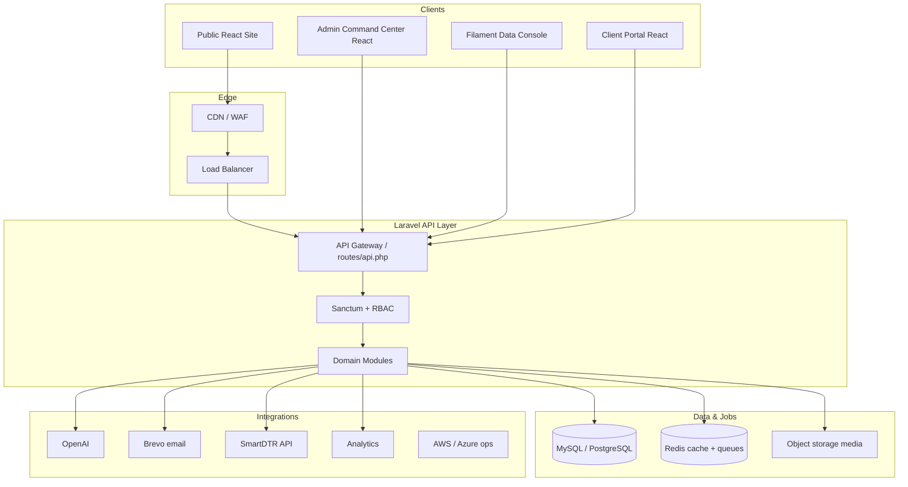
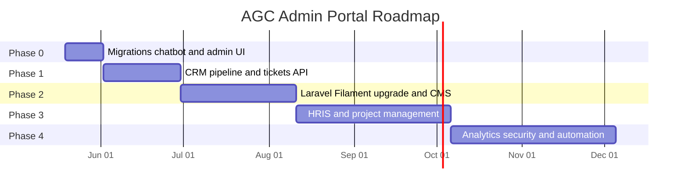

# AGC Enterprise Admin Portal — Architecture & Implementation Blueprint

**Version:** 1.0  
**Date:** May 2026  
**Status:** Strategic foundation (aligned with Colab-inspired public site + current monorepo)

---

## 1. Executive summary

AGC Global operates as a **dual-surface digital ecosystem**:

| Surface | Role | Stack |
|---------|------|-------|
| **Public website** | Premium client acquisition, brand, lead capture | React 19 + Vite + Tailwind v4 (`frontend/`) |
| **Admin command center** | Internal business OS (CRM, HRIS, CMS, ops) | React admin SPA + Laravel 8 API + Filament data console |

**Current reality:** Marketing site is enterprise-grade; admin portal is a lightweight CRM shell (~7 modules, basic KPIs). Filament v2 is installed but unused. Enterprise chatbot schema exists in migrations but is not applied or wired.

**Target:** SaaS-grade command center mirroring public-site branding (`#ff8c1a`, `#0a0f1f`, Inter, glassmorphism) with modular domain services behind a unified API.

---

## 2. Recommended architecture (hybrid)

### 2.1 Why hybrid (not Filament-only or React-only)

| Approach | Pros | Cons |
|----------|------|------|
| **Filament-only** | Fast CRUD, RBAC plugins | Hard to match Colab-level marketing UX; `/admin` route clash |
| **React-only** | Brand parity, rich dashboards | Slow to build every CRUD screen |
| **Hybrid (recommended)** | Best UX where it matters + fast ops back-office | Two UIs to maintain (clear boundaries) |

### 2.2 System diagram



### 2.3 URL & panel strategy

| Path | Product name | Purpose |
|------|--------------|---------|
| `/` | Public site | Marketing, chat widget, lead forms |
| `/admin/*` | **AGC Command Center** | Dashboards, CRM pipeline, analytics, AI ops (keep React) |
| `/console` | **AGC Data Console** | Filament v3+ CRUD (CMS entities, HR records, permissions) |
| `/portal` | **Client portal** | Deliverables, tickets, invoices (future) |

**Action:** Set `FILAMENT_PATH=console` in `.env` before enabling Filament.

---

## 3. Design system (admin alignment with public site)

Reuse tokens from `frontend/src/index.css`:

```css
/* Core brand */
--color-brand-primary: #ff8c1a;
--color-brand-primary-hover: #e07000;
--color-brand-secondary / navy: #0a0f1f;
--color-brand-night: #050816;
--color-brand-background: #f8f9fb;
--color-brand-gold: #ffd580;
```

### 3.1 Admin-specific tokens (extend `@theme`)

| Token | Light | Dark |
|-------|-------|------|
| `--admin-sidebar-bg` | `#f3f5f9` | `#0a0f1f` |
| `--admin-surface` | `#ffffff` | `rgba(10,15,31,0.85)` |
| `--admin-border` | `rgba(0,0,0,0.08)` | `rgba(255,255,255,0.08)` |
| `--admin-glass` | `bg-white/80 backdrop-blur-md` | `bg-brand-navy/40 backdrop-blur-xl` |

### 3.2 Component library (React admin)

| Component | Class / pattern | Usage |
|-----------|-----------------|-------|
| KPI card | `.enterprise-card` + orange accent bar | Dashboard metrics |
| Glass panel | `.glass-card` | Widgets, AI assistant |
| Section header | `.section-eyebrow` | Module titles |
| Primary CTA | `.btn-primary` | Actions |
| Data table | New `.admin-table` | Lists with sticky header |
| Sidebar | Collapsible module groups | 12+ modules |
| Topbar | Sticky, notifications, theme toggle, global search | All pages |

### 3.3 Filament theme

Publish Filament theme with Inter (not DM Sans), primary `#ff8c1a`, dark mode matching `--color-brand-night`.

---

## 4. Domain module map

### 4.1 Module registry

| Code | Module | Phase | Backend namespace | Primary UI |
|------|--------|-------|-------------------|------------|
| `cms` | Website CMS | 2 | `App\Domains\Cms` | Filament + React preview |
| `crm` | CRM & sales | 1–2 | `App\Domains\Crm` | React command center |
| `hris` | HRIS | 3 | `App\Domains\Hris` | Filament + employee portal |
| `pm` | Project management | 3 | `App\Domains\Projects` | React kanban |
| `ai` | Chatbot & knowledge | 1 | `App\Domains\Chatbot` | React + existing pipeline |
| `analytics` | Reporting | 2 | `App\Domains\Analytics` | React charts |
| `security` | Security & infra | 4 | `App\Domains\Security` | Filament + ops widgets |
| `support` | Ticketing | 1 | `App\Domains\Support` | React (replace localStorage) |
| `notify` | Notifications | 1 | `App\Domains\Notifications` | Topbar center |
| `auto` | Workflow automation | 4 | `App\Domains\Automation` | Filament rules builder |

### 4.2 Role-based access (RBAC)

Use `spatie/laravel-permission` or native `roles` + `permissions` tables.

| Role | CMS | CRM | HRIS | PM | AI | Analytics | Security |
|------|-----|-----|------|----|----|-----------|----------|
| Super Admin | ✓ | ✓ | ✓ | ✓ | ✓ | ✓ | ✓ |
| Marketing Admin | ✓ | read | — | — | ✓ | marketing | — |
| Sales Admin | read | ✓ | — | read | read | sales | — |
| HR Admin | — | — | ✓ | — | — | hr | — |
| Technical Admin | ✓ | read | — | ✓ | ✓ | ops | ✓ |
| Client Portal | — | own | — | own | — | own | — |

Extend `admin_users.role` → `admin_users` + `roles` pivot (migration `2026_05_16_100100` is a start).

---

## 5. Database schema (recommended)

### 5.1 Existing tables (keep)

- `admin_users`, `chat_messages`, `chat_conversations`, `chat_leads`
- `feedback_entries`, `announcements`, `newsletter_subscribers`
- Enterprise chatbot (migrate): `customer_profiles`, `faq_training_data`, `support_tickets`, etc.

### 5.2 Phase 1 — CRM & support foundation

```sql
-- Organizations & contacts
CREATE TABLE crm_accounts (
  id BIGINT UNSIGNED PRIMARY KEY AUTO_INCREMENT,
  name VARCHAR(255) NOT NULL,
  industry VARCHAR(64) NULL,
  website VARCHAR(255) NULL,
  status ENUM('prospect','active','churned') DEFAULT 'prospect',
  owner_admin_id BIGINT UNSIGNED NULL,
  metadata JSON NULL,
  created_at TIMESTAMP, updated_at TIMESTAMP,
  INDEX (status), FOREIGN KEY (owner_admin_id) REFERENCES admin_users(id)
);

CREATE TABLE crm_contacts (
  id BIGINT UNSIGNED PRIMARY KEY AUTO_INCREMENT,
  account_id BIGINT UNSIGNED NULL,
  email VARCHAR(255) NOT NULL,
  phone VARCHAR(64) NULL,
  name VARCHAR(255) NOT NULL,
  title VARCHAR(128) NULL,
  source VARCHAR(64) DEFAULT 'website',
  created_at TIMESTAMP, updated_at TIMESTAMP,
  FOREIGN KEY (account_id) REFERENCES crm_accounts(id) ON DELETE SET NULL
);

-- Pipeline
CREATE TABLE crm_pipeline_stages (
  id SMALLINT UNSIGNED PRIMARY KEY AUTO_INCREMENT,
  name VARCHAR(64) NOT NULL,
  sort_order TINYINT UNSIGNED NOT NULL,
  probability TINYINT UNSIGNED DEFAULT 0,
  is_won BOOLEAN DEFAULT FALSE,
  is_lost BOOLEAN DEFAULT FALSE
);

CREATE TABLE crm_deals (
  id BIGINT UNSIGNED PRIMARY KEY AUTO_INCREMENT,
  account_id BIGINT UNSIGNED NULL,
  contact_id BIGINT UNSIGNED NULL,
  stage_id SMALLINT UNSIGNED NOT NULL,
  title VARCHAR(255) NOT NULL,
  value DECIMAL(14,2) DEFAULT 0,
  currency CHAR(3) DEFAULT 'PHP',
  expected_close_date DATE NULL,
  lead_score TINYINT UNSIGNED DEFAULT 0,
  chat_lead_id BIGINT UNSIGNED NULL,
  assigned_admin_id BIGINT UNSIGNED NULL,
  created_at TIMESTAMP, updated_at TIMESTAMP
);

-- Activity log (communications)
CREATE TABLE crm_activities (
  id BIGINT UNSIGNED PRIMARY KEY AUTO_INCREMENT,
  deal_id BIGINT UNSIGNED NULL,
  contact_id BIGINT UNSIGNED NULL,
  type ENUM('email','call','meeting','note','task') NOT NULL,
  subject VARCHAR(255) NULL,
  body TEXT NULL,
  due_at TIMESTAMP NULL,
  completed_at TIMESTAMP NULL,
  admin_user_id BIGINT UNSIGNED NULL,
  created_at TIMESTAMP, updated_at TIMESTAMP
);

-- Link chat leads to CRM
ALTER TABLE chat_leads ADD COLUMN crm_deal_id BIGINT UNSIGNED NULL AFTER id;
```

### 5.3 Phase 2 — CMS

```sql
CREATE TABLE cms_pages (
  id BIGINT UNSIGNED PRIMARY KEY AUTO_INCREMENT,
  slug VARCHAR(128) UNIQUE NOT NULL,
  title VARCHAR(255) NOT NULL,
  template VARCHAR(64) DEFAULT 'default',
  status ENUM('draft','published','archived') DEFAULT 'draft',
  published_at TIMESTAMP NULL,
  seo_title VARCHAR(70) NULL,
  seo_description VARCHAR(160) NULL,
  og_image_id BIGINT UNSIGNED NULL,
  created_at TIMESTAMP, updated_at TIMESTAMP
);

CREATE TABLE cms_blocks (
  id BIGINT UNSIGNED PRIMARY KEY AUTO_INCREMENT,
  page_id BIGINT UNSIGNED NOT NULL,
  block_type VARCHAR(64) NOT NULL, -- hero, cta, features, html
  sort_order INT UNSIGNED DEFAULT 0,
  content JSON NOT NULL,
  created_at TIMESTAMP, updated_at TIMESTAMP,
  FOREIGN KEY (page_id) REFERENCES cms_pages(id) ON DELETE CASCADE
);

CREATE TABLE cms_media (
  id BIGINT UNSIGNED PRIMARY KEY AUTO_INCREMENT,
  disk VARCHAR(32) DEFAULT 's3',
  path VARCHAR(512) NOT NULL,
  mime VARCHAR(128) NULL,
  alt_text VARCHAR(255) NULL,
  size_bytes BIGINT UNSIGNED NULL,
  uploaded_by BIGINT UNSIGNED NULL,
  created_at TIMESTAMP, updated_at TIMESTAMP
);

CREATE TABLE cms_blog_posts (
  id BIGINT UNSIGNED PRIMARY KEY AUTO_INCREMENT,
  slug VARCHAR(128) UNIQUE NOT NULL,
  title VARCHAR(255) NOT NULL,
  excerpt TEXT NULL,
  body LONGTEXT NOT NULL,
  author_admin_id BIGINT UNSIGNED NULL,
  featured_media_id BIGINT UNSIGNED NULL,
  status ENUM('draft','published') DEFAULT 'draft',
  published_at TIMESTAMP NULL,
  created_at TIMESTAMP, updated_at TIMESTAMP
);

CREATE TABLE cms_testimonials (
  id BIGINT UNSIGNED PRIMARY KEY AUTO_INCREMENT,
  client_name VARCHAR(128) NOT NULL,
  company VARCHAR(128) NULL,
  quote TEXT NOT NULL,
  rating TINYINT UNSIGNED NULL,
  is_featured BOOLEAN DEFAULT FALSE,
  sort_order INT UNSIGNED DEFAULT 0,
  created_at TIMESTAMP, updated_at TIMESTAMP
);

CREATE TABLE cms_portfolio_items (
  id BIGINT UNSIGNED PRIMARY KEY AUTO_INCREMENT,
  slug VARCHAR(128) UNIQUE NOT NULL,
  title VARCHAR(255) NOT NULL,
  category VARCHAR(64) NULL,
  summary TEXT NULL,
  tech_stack JSON NULL,
  cover_media_id BIGINT UNSIGNED NULL,
  case_study_url VARCHAR(512) NULL,
  sort_order INT UNSIGNED DEFAULT 0,
  created_at TIMESTAMP, updated_at TIMESTAMP
);
```

### 5.4 Phase 3 — HRIS

```sql
CREATE TABLE hris_departments (
  id SMALLINT UNSIGNED PRIMARY KEY AUTO_INCREMENT,
  name VARCHAR(128) NOT NULL,
  code VARCHAR(16) UNIQUE NULL
);

CREATE TABLE hris_employees (
  id BIGINT UNSIGNED PRIMARY KEY AUTO_INCREMENT,
  employee_no VARCHAR(32) UNIQUE NOT NULL,
  user_id BIGINT UNSIGNED NULL, -- optional link to admin_users
  department_id SMALLINT UNSIGNED NULL,
  first_name VARCHAR(128) NOT NULL,
  last_name VARCHAR(128) NOT NULL,
  email VARCHAR(255) UNIQUE NOT NULL,
  employment_status ENUM('active','on_leave','terminated') DEFAULT 'active',
  hired_at DATE NULL,
  smartdtr_external_id VARCHAR(64) NULL,
  created_at TIMESTAMP, updated_at TIMESTAMP
);

CREATE TABLE hris_attendance_logs (
  id BIGINT UNSIGNED PRIMARY KEY AUTO_INCREMENT,
  employee_id BIGINT UNSIGNED NOT NULL,
  clock_in_at TIMESTAMP NOT NULL,
  clock_out_at TIMESTAMP NULL,
  source ENUM('smartdtr','manual','import') DEFAULT 'smartdtr',
  metadata JSON NULL,
  INDEX (employee_id, clock_in_at)
);

CREATE TABLE hris_leave_requests (
  id BIGINT UNSIGNED PRIMARY KEY AUTO_INCREMENT,
  employee_id BIGINT UNSIGNED NOT NULL,
  type VARCHAR(32) NOT NULL,
  start_date DATE NOT NULL,
  end_date DATE NOT NULL,
  status ENUM('pending','approved','rejected') DEFAULT 'pending',
  approver_id BIGINT UNSIGNED NULL,
  created_at TIMESTAMP, updated_at TIMESTAMP
);
```

### 5.5 Phase 3 — Project management

```sql
CREATE TABLE pm_projects (
  id BIGINT UNSIGNED PRIMARY KEY AUTO_INCREMENT,
  account_id BIGINT UNSIGNED NULL,
  name VARCHAR(255) NOT NULL,
  status ENUM('planning','active','on_hold','completed') DEFAULT 'planning',
  start_date DATE NULL,
  due_date DATE NULL,
  budget DECIMAL(14,2) NULL,
  created_at TIMESTAMP, updated_at TIMESTAMP
);

CREATE TABLE pm_boards (
  id BIGINT UNSIGNED PRIMARY KEY AUTO_INCREMENT,
  project_id BIGINT UNSIGNED NOT NULL,
  name VARCHAR(128) DEFAULT 'Main'
);

CREATE TABLE pm_tasks (
  id BIGINT UNSIGNED PRIMARY KEY AUTO_INCREMENT,
  board_id BIGINT UNSIGNED NOT NULL,
  column_key VARCHAR(32) NOT NULL, -- backlog, in_progress, review, done
  title VARCHAR(255) NOT NULL,
  assignee_admin_id BIGINT UNSIGNED NULL,
  due_at TIMESTAMP NULL,
  sort_order INT UNSIGNED DEFAULT 0,
  created_at TIMESTAMP, updated_at TIMESTAMP
);

CREATE TABLE pm_milestones (
  id BIGINT UNSIGNED PRIMARY KEY AUTO_INCREMENT,
  project_id BIGINT UNSIGNED NOT NULL,
  title VARCHAR(255) NOT NULL,
  due_date DATE NOT NULL,
  completed_at TIMESTAMP NULL
);
```

### 5.6 Cross-cutting tables

```sql
CREATE TABLE audit_logs (
  id BIGINT UNSIGNED PRIMARY KEY AUTO_INCREMENT,
  admin_user_id BIGINT UNSIGNED NULL,
  action VARCHAR(64) NOT NULL,
  entity_type VARCHAR(128) NOT NULL,
  entity_id BIGINT UNSIGNED NULL,
  ip_address VARCHAR(45) NULL,
  user_agent VARCHAR(512) NULL,
  changes JSON NULL,
  created_at TIMESTAMP DEFAULT CURRENT_TIMESTAMP,
  INDEX (entity_type, entity_id),
  INDEX (created_at)
);

CREATE TABLE notifications (
  id BIGINT UNSIGNED PRIMARY KEY AUTO_INCREMENT,
  admin_user_id BIGINT UNSIGNED NOT NULL,
  type VARCHAR(64) NOT NULL,
  title VARCHAR(255) NOT NULL,
  body TEXT NULL,
  data JSON NULL,
  read_at TIMESTAMP NULL,
  created_at TIMESTAMP DEFAULT CURRENT_TIMESTAMP,
  INDEX (admin_user_id, read_at)
);

CREATE TABLE automation_workflows (
  id BIGINT UNSIGNED PRIMARY KEY AUTO_INCREMENT,
  name VARCHAR(128) NOT NULL,
  trigger_event VARCHAR(64) NOT NULL,
  conditions JSON NULL,
  actions JSON NOT NULL,
  is_active BOOLEAN DEFAULT TRUE,
  created_at TIMESTAMP, updated_at TIMESTAMP
);

CREATE TABLE analytics_snapshots (
  id BIGINT UNSIGNED PRIMARY KEY AUTO_INCREMENT,
  metric_key VARCHAR(64) NOT NULL,
  dimension VARCHAR(64) DEFAULT 'global',
  value DECIMAL(18,4) NOT NULL,
  recorded_at DATE NOT NULL,
  metadata JSON NULL,
  UNIQUE (metric_key, dimension, recorded_at)
);
```

---

## 6. API structure (Laravel)

Refactor from flat controllers to domain modules:

```
backend/app/
  Domains/
    Cms/Http/Controllers/
    Crm/Http/Controllers/
    Hris/Http/Controllers/
    Chatbot/Services/ChatbotAiPipeline.php  (move)
    Analytics/Services/
  Http/Middleware/EnsureAdminUser.php
  Http/Middleware/CheckPermission.php
routes/
  api.php              # public + legacy
  api/admin.php        # Sanctum admin routes
  api/portal.php       # client portal (future)
```

### 6.1 Example admin route groups

```php
Route::prefix('admin')->middleware(['auth:sanctum', 'ensure.admin'])->group(function () {
    Route::get('overview', [DashboardController::class, 'overview']);
    Route::apiResource('deals', DealController::class);
    Route::post('deals/{deal}/move-stage', [DealController::class, 'moveStage']);
    Route::apiResource('tickets', SupportTicketController::class);
    Route::apiResource('faq-training', FaqTrainingController::class);
    // ...
});
```

---

## 7. Frontend structure (React command center)

```
frontend/src/
  admin/
    layout/AdminShell.jsx      # upgrade: dark mode, module nav
    components/
      KpiCard.jsx
      DataTable.jsx
      PipelineBoard.jsx
      NotificationCenter.jsx
      ThemeToggle.jsx
    modules/
      dashboard/
      crm/
      cms/          # embed or link to Filament
      hris/
      projects/
      chatbot/
      analytics/
      security/
    hooks/
    lib/adminPortalApi.js
```

### 7.1 Navigation (target)

| Group | Items |
|-------|-------|
| **Overview** | Dashboard, Analytics, AI Assistant |
| **Revenue** | Leads, Pipeline, Accounts, Proposals |
| **Delivery** | Projects, Tickets, QA |
| **People** | Employees, Attendance, Leave, Recruitment |
| **Marketing** | CMS, Blog, Portfolio, SEO, Media |
| **Engagement** | Chat CRM, Chatbot training, Newsletter |
| **System** | Users & roles, Audit log, Integrations, Backups |

---

## 8. AI & automation

### 8.1 Wire existing chatbot pipeline

1. Run `php artisan migrate` (enterprise schema).
2. In `AiChatController`, delegate to `ChatbotAiPipeline`:
   - Load active `faq_training_data`
   - Persist `customer_intents`, `chatbot_messages`
   - Create `support_tickets` on escalation
3. Admin UI: FAQ CRUD, intent analytics, escalation queue.

### 8.2 Lead scoring (rule-based → ML later)

```
score = source_weight + engagement_messages*2 + faq_intent_commercial*15 + form_complete*20
```

Store on `crm_deals.lead_score`; expose in pipeline cards.

### 8.3 Automation examples

| Trigger | Action |
|---------|--------|
| `chat_lead.created` | Create deal in stage "New", notify sales |
| `deal.stage.won` | Create project stub, send Brevo email |
| `ticket.escalated` | Assign round-robin, Slack/webhook |
| `employee.leave.approved` | Sync SmartDTR |

---

## 9. Security framework

| Layer | Implementation |
|-------|----------------|
| Auth | Sanctum tokens, short TTL + refresh for admin |
| RBAC | Spatie permissions on `AdminUser` |
| Audit | `audit_logs` on all mutating admin actions |
| PII | Encrypt email/phone on `customer_profiles` (already in schema) |
| API keys | `integration_credentials` table, encrypted at rest |
| Rate limit | Laravel throttle on `/api/ai/chat`, login |
| CSP | Strict headers on public + admin |
| Backups | Daily DB + S3 media; monitor in Security module |

---

## 10. Infrastructure & scale path

| Concern | Now | Scale |
|---------|-----|-------|
| App server | XAMPP / `artisan serve` | PHP-FPM + Nginx |
| Queue | Sync | Redis + Horizon |
| Cache | File | Redis |
| Media | Local `storage/` | S3 + CloudFront |
| DB | MySQL | MySQL 8 or PostgreSQL 15 |
| Process manager | PM2 (`ecosystem.config.cjs`) | Supervisor + Horizon |
| Multi-tenant | Single org | `tenant_id` on major tables when needed |

**Upgrade path:** Laravel 8 → 10/11 and Filament v2 → v3 when starting Phase 2 CMS (Filament v3 requires Laravel 10+).

---

## 11. Implementation phases



### Phase 0 — Foundation (1–2 weeks)

- [ ] Run pending migrations; wire `ChatbotAiPipeline`
- [ ] Set `FILAMENT_PATH=console`; scaffold Filament panel + brand theme
- [ ] Admin design system: dark mode, glass cards, module sidebar in `AdminShell`
- [ ] RBAC on `admin_users`; middleware `permission:*`
- [ ] Replace ticket localStorage with `support_tickets` API
- [ ] `notifications` table + topbar center
- [ ] Audit logging trait on admin mutations

### Phase 1 — CRM & support (3–4 weeks)

- [ ] CRM tables + API + React pipeline board
- [ ] Link `chat_leads` → `crm_deals`
- [ ] Activity timeline per deal/contact
- [ ] Enhanced dashboard KPIs (conversion, open deals, SLA)

### Phase 2 — CMS & marketing ops (4–6 weeks)

- [ ] CMS tables; Filament resources for pages, blog, portfolio, testimonials
- [ ] Public site reads CMS via API (replace static `marketingContent.js` gradually)
- [ ] Media library + SEO fields
- [ ] Landing page builder (block JSON)

### Phase 3 — HRIS & projects (6–8 weeks)

- [ ] HRIS tables + Filament employee admin
- [ ] SmartDTR integration service
- [ ] PM kanban + milestones + billing hooks

### Phase 4 — Analytics, security, automation (ongoing)

- [ ] Analytics snapshots + chart dashboards (Chart.js or Tremor)
- [ ] Security module: audit viewer, API keys, backup status
- [ ] Workflow engine + Brevo campaign activation
- [ ] Client portal (`/portal`)

---

## 12. Filament implementation checklist

1. Upgrade Laravel to 10+ and Filament to v3 (recommended before heavy Filament work).
2. `php artisan filament:install --panels`
3. Create `AdminPanelProvider` with:
   - `->path('console')`
   - `->login()` using `AdminUser` model + custom guard
   - Brand colors from AGC tokens
4. Resources (priority):
   - `FaqTrainingDataResource`
   - `AnnouncementResource` (migrate from API-only)
   - `CmsPageResource`, `CmsBlogPostResource`
   - `HrisEmployeeResource`
   - `RoleResource` (if using Spatie)
5. Widgets: `StatsOverviewWidget`, `LatestLeadsWidget`

---

## 13. Business alignment matrix

| Public site goal | Admin capability |
|------------------|------------------|
| Lead generation | CRM pipeline, lead scoring, chat → deal |
| Brand management | CMS, media library, testimonials |
| Customer acquisition | Proposals, contracts, onboarding checklist |
| Conversion optimization | A/B blocks, analytics, funnel reports |
| Corporate scaling | HRIS, PM, resource allocation |
| Investor readiness | Revenue dashboards, audit trail, security posture |

---

## 14. Success metrics

| KPI | Target (6 months) |
|-----|-------------------|
| Lead → deal conversion tracked | 100% of chat/form leads in CRM |
| CMS content editable without deploy | 90% of marketing copy in DB |
| Mean time to assign ticket | < 4 hours |
| Admin NPS (internal) | ≥ 8/10 |
| Public/admin brand consistency | Design audit pass |

---

## 15. Immediate next steps (engineering)

1. `php artisan migrate` on dev DB.
2. Integrate `ChatbotAiPipeline` in `AiChatController`.
3. Redesign `AdminShell` + `AdminOverview` with design system tokens and dark mode.
4. Add `docs/` migration batch for `crm_*` tables (Phase 1).
5. Plan Laravel/Filament upgrade spike before Phase 2 CMS.

---

*This document is the canonical reference for AGC Admin Portal modernization. Update version on major architectural decisions.*
